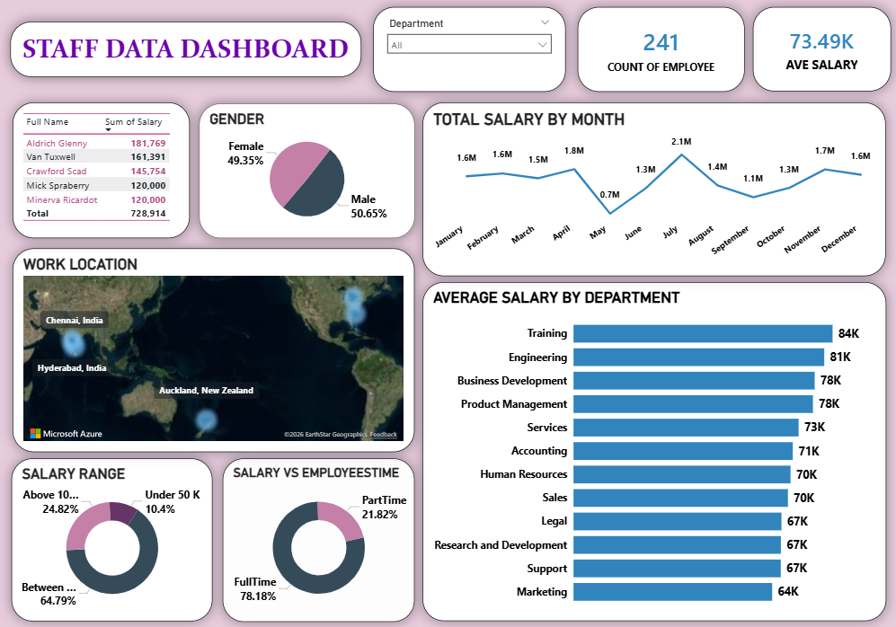

# 📊 Staff Data Analysis Dashboard

## Power BI Project

## 📄 Overview
This project provides a comprehensive analysis of **Human Resources and Payroll data**, focusing on employee distribution, salary structures, and departmental performance to help HR management make data-driven decisions.

## 🖼️ Dashboard Preview

## 🔑 Key Metrics
* **Total Employees:** 241 Count
* **Average Salary:** 73.49K
* **Full-Time vs Part-Time:** 78.18% Full-Time employees.
* **Gender Distribution:** Balanced workforce with **50.65% Male** and **49.35% Female**.

## 🚀 Main Insights

* **🌍 Global Presence:** The workforce is strategically distributed across key locations including **Chennai (India)**, **Hyderabad (India)**, and **Auckland (New Zealand)**.

* **💰 Departmental Compensation:** The **Training** department has the highest average salary at **84K**, followed closely by **Engineering** at **81K**. **Marketing** has the lowest average at **64K**.

* **📈 Payroll Trends:** Total salary expenditure showed a significant peak in **July (2.1M)**, with
*
